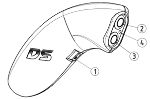
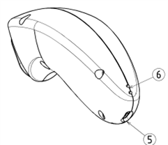

# 🎮 DS TELECOMMANDE (DS REMOTE)

## 🔹 Caractéristiques

 

1. **Interrupteur marche/arrêt**
2. **Bouton poussoir momentané**
3. **Bouton poussoir momentané**
4. **Indicateur LED bleu ou rouge** (alimentation)
5. **Port USB-C** pour charge ou alimentation
6. **Indicateur LED de charge**

### ✔️ Spécifications
- **Modèle** : DS Remote Control (Quantité : 2)
- **Matériau** : PLA+
- **Carte électronique** : DS PCB
- **Poids** : 100g (avec batterie)
- **Tension de fonctionnement** : 3.2V - 5V
- **Interface externe** : USB-C
- **Module de transmission** : Bluetooth
- **Système de charge** : Batterie lithium-ion intégrée, charge via USB 5V - 1A

### ✔️ Utilisation
- **Bouton 2** : Incrémentation du score (+1)
- **Bouton 3** : Décrémentation du score (-1)
- 💡 **Astuce** : Maintenez le bouton enfoncé suffisamment longtemps pour valider le but (+1 uniquement). Règle -> Attendre que tous les drones soient revenus dans leur moitié de terrain.

### ✔️ Charge
- Brancher le câble **USB-C** (non inclus) dans le port (5)
- S'assurer que l'interrupteur (1) est en position **éteinte (off)**
- La LED rouge (6) indique que la télécommande est **en charge**
- La LED verte (6) indique que la télécommande est **chargée**

⚠️ **Important** : La télécommande peut être utilisée pendant la charge avec l'interrupteur en position **allumée (on)**. Elle est équipée d'une **batterie Li-ion 3.7V 650mAh**.

⏳ **Autonomie théorique** : 5 heures, mais pour une **grande compétition**, il est conseillé de connecter une **power bank de 10 000mAh**.

---

# 🎯 DS BUT (DS GOAL)

### 🔹 Caractéristiques

1. **Boulons à œil M4 x2**
2. **Connecteur XT30 DC 24V**
3. **Alimentation 24V 300W** (Quantité : 1)

### ✔️ Spécifications
- **Modèle** : DS GOAL (Quantité : 2)
- **Poids** : 800g
- **Matériau** : PETG
- **Diamètre extérieur** : 520mm / **Diamètre intérieur** : 400mm
- **Interface externe** : Connecteur **DC 24V XT30**
- **Module de transmission** : WiFi
- **Alimentation** : 24V

### ✔️ Utilisation
- Suspendre les buts à l'arène avec les anneaux et **connecter l'alimentation**.
- Utiliser les **câbles fournis** pour connecter les buts.
- 💡 **Astuce** : Placer le **but rouge à gauche** et le **but bleu à droite** du terrain.
- 💡 **Astuce** : Réaliser l'opération pour **les 2 buts** et les connecter via **l'application** (voir chapitre 4).

---

# 🧠 DS BOÎTIER DE CONTRÔLE (DS CONTROL BOX)

### ✔️ Connexion
- Connecter **les antennes WiFi et Bluetooth** (USB, nécessaire pour la communication entre les buts, les télécommandes et le boîtier).
- Brancher l'alimentation fournie au **boîtier (USB-C) et à une prise 220V**.
- Connecter le **boîtier avec un câble RJ45** à votre **ordinateur**.

---

# 💻 DS LOGICIEL (DS SOFTWARE)

### 🔹 Accès au système
- Ouvrir un navigateur Internet (**Chrome ou Edge**) et saisir :  
  **[http://dronesoccer.local](http://dronesoccer.local)**
- Un message d'avertissement peut apparaître :
  - Cliquer sur **"Paramètres avancés"**
  - Puis **"Continuer vers dronesoccer.local (dangereux)"**

### 🔹 Accès alternatif (non recommandé à cause de la latence)
1. **Allumer le Raspberry Pi**
2. Attendre la création du **point d'accès WiFi** nommé : `DroneSoccer`
3. **Mot de passe** : `DroneSoccer`
4. Ouvrir un navigateur et saisir : **[http://dronesoccer.local](http://dronesoccer.local)**

🎯 Vous arriverez alors sur la page d'accueil du logiciel.

